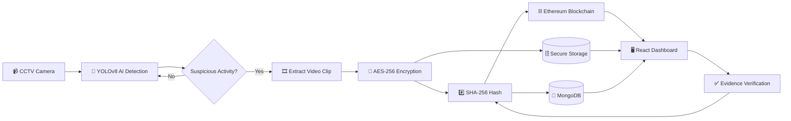
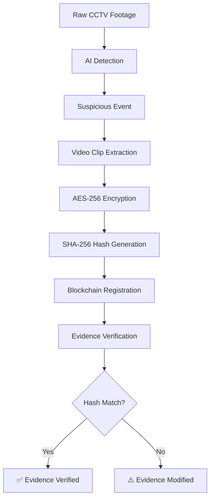
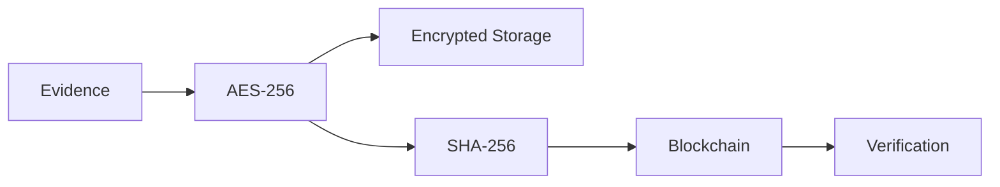

# 🚨 Intelligent Mob Surveillance System

### AI-Powered CCTV Surveillance with Blockchain-Secured Digital Evidence

An intelligent surveillance framework that uses **YOLOv8** to detect suspicious activities in real time and combines **AES-256, SHA-256, and Ethereum Blockchain** to protect and verify digital evidence.
---

## ✨ Features

| Feature                    | Technology          |
| -------------------------- | ------------------- |
| 🎥 Real-time surveillance  | OpenCV              |
| 🤖 Activity detection      | YOLOv8              |
| 📹 Evidence extraction     | OpenCV              |
| 🔐 Evidence encryption     | AES-256             |
| #️⃣ Integrity verification | SHA-256             |
| ⛓️ Immutable hash logging  | Ethereum + Solidity |
| 🗄️ Metadata storage       | MongoDB             |
| 🔑 Authentication          | JWT                 |
| 🖥️ Monitoring dashboard   | React + Vite        |

---

## 🏗️ System Architecture



---

## 🔄 Evidence Security Flow



---

## 🧠 How It Works

```text
CCTV
  ↓
YOLOv8 Detection
  ↓
Suspicious Activity
  ↓
Video Extraction
  ↓
AES-256 Encryption
  ↓
SHA-256 Hash
  ↓
Ethereum Blockchain
  ↓
Verification Dashboard
```

The **video is stored off-chain**, while its SHA-256 hash is recorded on the blockchain. During verification, the evidence is hashed again and compared with the blockchain record.

---

## 🛠️ Tech Stack

```text
AI              → YOLOv8 • OpenCV • MediaPipe
Backend         → Python • FastAPI • MongoDB
Blockchain      → Ethereum • Solidity • Ganache • Web3.py
Frontend        → React • Vite
Security        → AES-256 • SHA-256 • JWT
```

---

## 📁 Project Structure

```text
intelligent-surveillance-system/
│
├── backend/           # FastAPI backend & AI processing
├── frontend/          # React dashboard
├── smart-contracts/   # Solidity contracts
├── models/            # AI models
├── storage/           # Encrypted evidence
├── scripts/           # Utility & deployment scripts
├── docker-compose.prod.yml
└── README.md
```

---

## 🚀 Quick Start

### Clone

```bash
git clone https://github.com/harshpandeyz/intelligent-surveillance-system-v2.git
cd intelligent-surveillance-system-v2
```

### Backend

```bash
python3 -m venv venv
source venv/bin/activate
pip install -r backend/requirements.txt
```

### Frontend

```bash
cd frontend
npm install
npm run dev
```

### Docker

```bash
docker compose -f docker-compose.prod.yml up -d
```

---

## 🔐 Security Model



**Confidentiality** → AES-256
**Integrity** → SHA-256
**Immutable Record** → Ethereum
**Authentication** → JWT

---

## 🎯 Applications

* 🏙️ Smart-city surveillance
* 🎓 Campus security
* 🏭 Industrial security
* 🚉 Public-space monitoring
* ⚖️ Digital evidence verification

---

## 👨‍💻 Author

**Harsh Pandey**
B.Tech Information Technology — MIT ADT University, Pune

[GitHub](https://github.com/harshpandeyz)

---

<p align="center">
  <b>AI Detection × Cryptography × Blockchain</b><br>
  Building a more intelligent and verifiable surveillance system.
</p>
